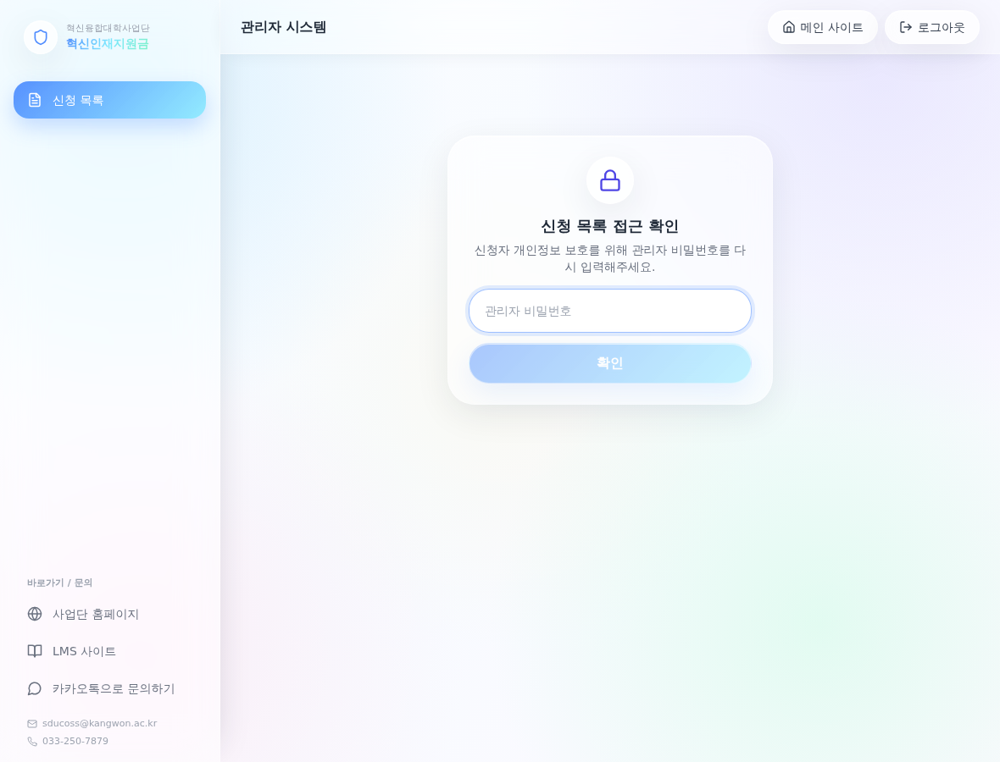
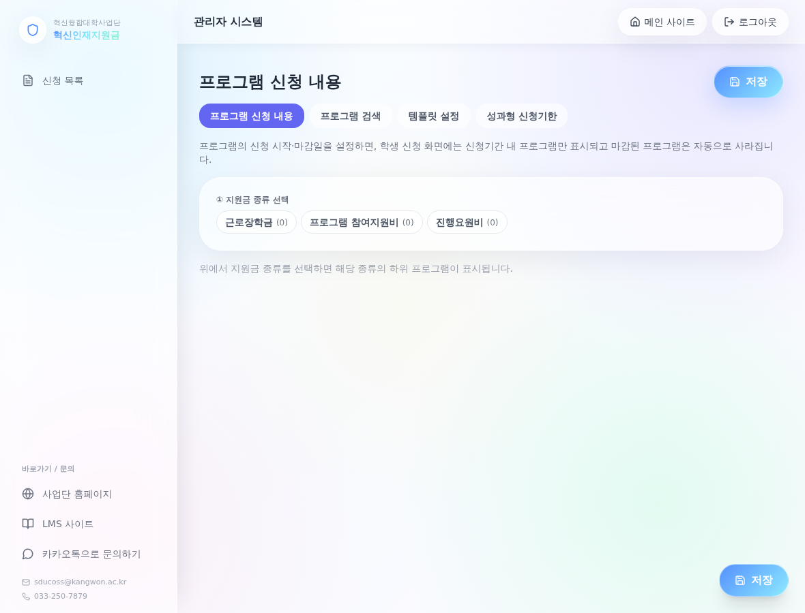
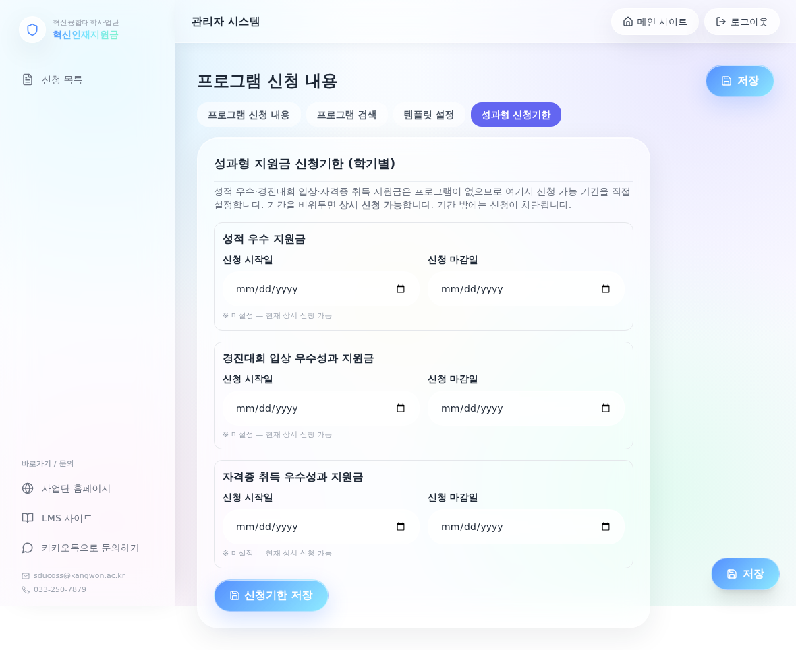
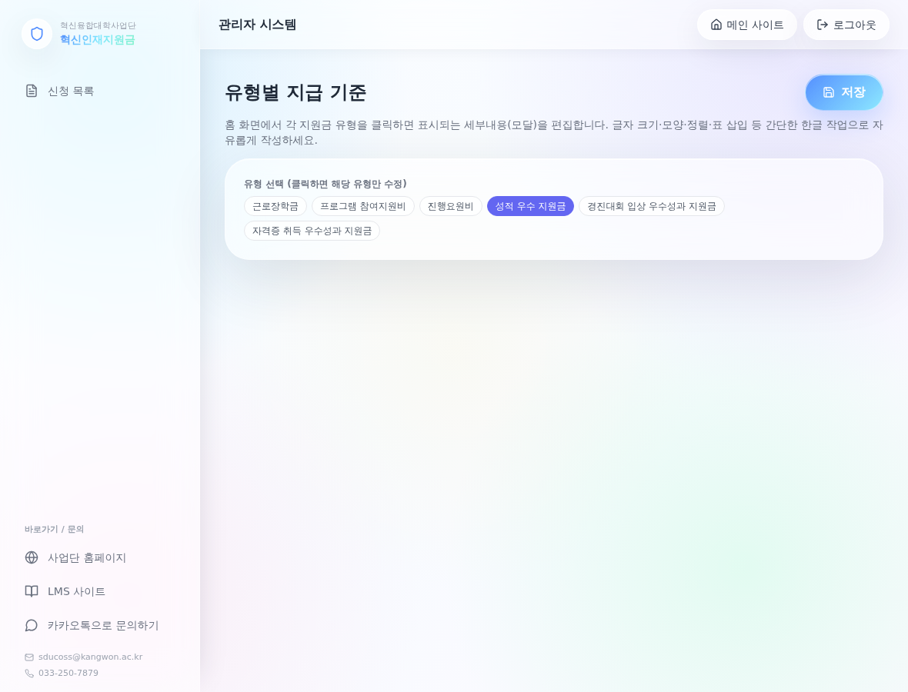
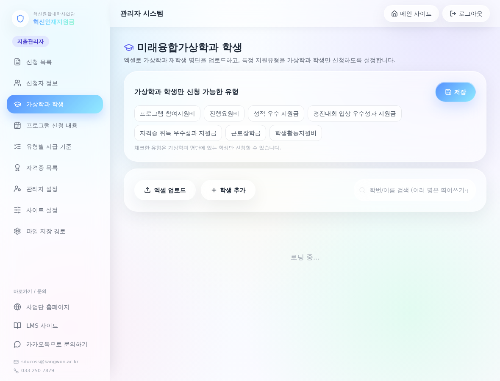

# 관리자 매뉴얼 — 학생 지원금 신청 플랫폼

이 문서는 사업단 담당자가 플랫폼을 운영하는 방법을 단계별로 안내합니다.

> 일부 화면은 실제 데이터가 있어야 표시되므로, 데이터가 없는 화면은 설명으로 안내합니다.

---

## 1. 관리자 로그인

- 메인 사이트 하단의 **관리자 로그인**으로 접속합니다.
- **지출관리자**(전체 권한): 아이디 + 비밀번호로 로그인
- **프로그램 관리자**: 지출관리자가 등록한 계정으로 로그인(담당 프로그램만 관리)
- 일부 메뉴(신청자 정보·가상학과)는 **진입 시마다 관리자 비밀번호를 한 번 더 입력**합니다(개인정보 보호).

---

## 2. 관리자 대시보드

- 신청 현황 요약을 확인합니다(역할별 집계).

---

## 3. 프로그램 신청 내용 설정 (핵심)

- **① 지원금 종류 선택**에서 **근로장학금 / 프로그램 참여지원비 / 진행요원비**를 **직접 구분**해 선택합니다.
  - 여기서 고른 종류로 프로그램이 분류되어, **해당 종류에서만** 학생에게 노출됩니다. (참여지원비에 등록한 프로그램은 진행요원비에 보이지 않음)
- **② 프로그램 추가/선택** → 프로그램명·역할·**신청 기간(지원신청/지원금 단계별)** 설정
- **③ 신청 폼 빌더**: 학생이 작성할 항목(서술형·파일·동의·서명 등)을 구글폼처럼 구성
  - **파일 항목 안내창**: 업로드 직전 학생에게 띄울 안내문구 설정(예: "재학증명서는 직인 날인본 제출")
- 단계별(지원신청/지원금) **활성/비활성** 토글로 노출을 제어합니다.
- 작성 후 **저장**을 눌러야 반영됩니다.

### 3-1. 성과형 신청기한 설정

- 프로그램이 없는 **성적 우수·경진대회·자격증**은 **‘성과형 신청기한’ 탭**에서 학기별 신청 기간을 직접 설정합니다.
- 기간을 비우면 **상시 신청**, 설정하면 그 기간에만 신청 가능하며 **홈 화면 카드와 신청 화면에 자동 반영**됩니다.

---

## 4. 유형별 지급 기준(홈 모달) 편집

- 홈 화면에서 각 지원금을 클릭하면 뜨는 **세부내용**을 편집합니다.
- 글자 크기·색·정렬·표 삽입 등 **한글 서식**으로 자유롭게 작성하고 **저장**합니다.
- 저장하면 홈 모달에 그대로 표시됩니다.

---

## 5. 신청자 관리 (신청자 정보)

> 진입 시 관리자 비밀번호를 한 번 더 입력합니다.

### 5-1. 신청자 직접 등록(회원가입 처리)

- **신청자 등록** 버튼 → 학번·이름·비밀번호·소속·연락처·계좌 입력 → 계정 생성
- 생성된 학번/비밀번호를 학생에게 안내하면, 학생이 바로 로그인할 수 있습니다.

### 5-2. 대리 신청 (프로그램 참여지원비)

- 신청자 목록의 각 행에서 **지원신청 / 지원금** 버튼을 누르면, **그 학생 정보가 자동 입력된 프로그램 참여지원비 신청서**가 열립니다.
- 관리자가 작성·제출하면 **학생이 직접 신청한 것과 동일하게** 신청목록에 등록됩니다(해당 학생 명의).
- **AI 초안**: 활동계획·기대성과 등 **신청자마다 달라지는 서술형 항목**은 ✨ **AI 초안** 버튼으로 자동 작성할 수 있습니다.
  - 동작하려면 서버에 `ANTHROPIC_API_KEY` 환경변수가 설정되어 있어야 합니다.

### 5-3. 기타

- **지원신청 면제** 설정(지원신청 없이 지원금 신청 허용), **비밀번호 재설정**
- 학적상태 컬럼·이전 학번 표시로 학생 식별

---

## 6. 신청 목록 / 검토 / 내보내기

- **신청 목록**에서 접수된 신청을 조회하고, 상세에서 **검토 상태·지급 상태**를 변경합니다.
- 관리자가 통장 사본을 보고 **확인 계좌(verified_account)** 를 직접 입력합니다(자동 비교 없음).
- **PDF 저장**(지급신청서·지출자료·심의요청서)과 **엑셀 내보내기**를 지원합니다.
  - 저장 파일명은 `{접수번호} {유형} …_({이름}_{학번})` 형식으로 자동 생성됩니다.

---

## 7. 가상학과(미래융합가상학과) 명단

- 자격증 등 **가상학과 학생 전용 유형**의 자격 확인을 위해 명단을 업로드/관리합니다.
- 어떤 지원유형을 가상학과 전용으로 둘지 설정할 수 있습니다.

---

## 8. 운영 체크리스트

- [ ] 프로그램 신청 내용에서 **종류별(참여지원비/진행요원비) 프로그램·기간** 설정
- [ ] 성과형(성적·경진대회·자격증) **신청기한** 설정
- [ ] **유형별 지급 기준** 내용 최신화
- [ ] 학생에게 **연구통합관리시스템 계좌 등록** 안내(필수)
- [ ] 접수된 신청 **검토·상태변경·지급 처리**
- [ ] (선택) `ANTHROPIC_API_KEY` 설정 시 대리신청 **AI 초안** 사용 가능

문의: 사업단 사무국 033-250-7879 / sducoss@kangwon.ac.kr
