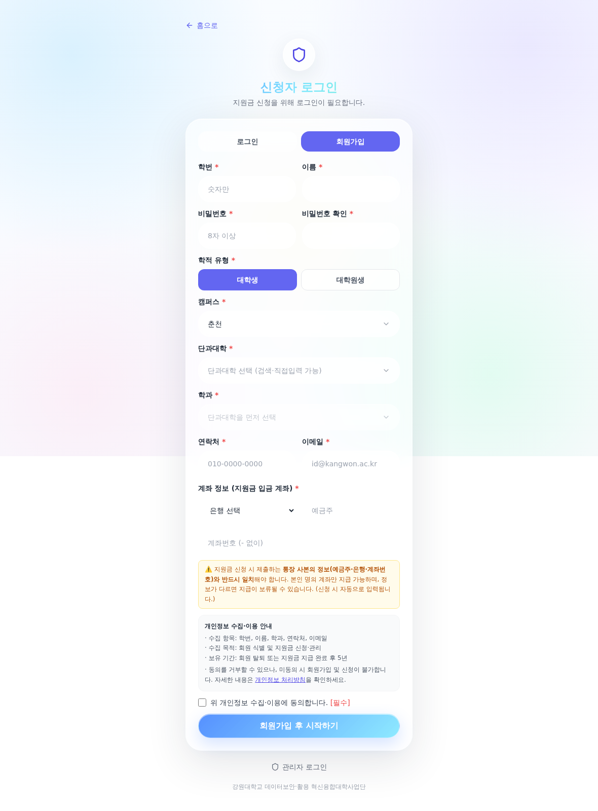
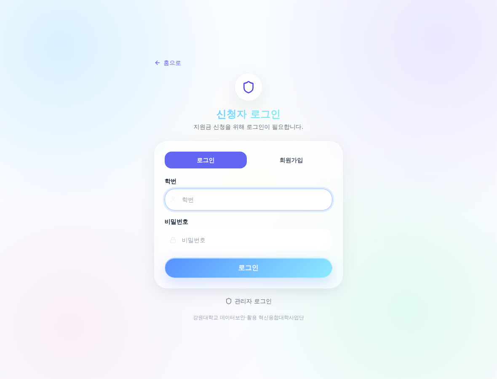
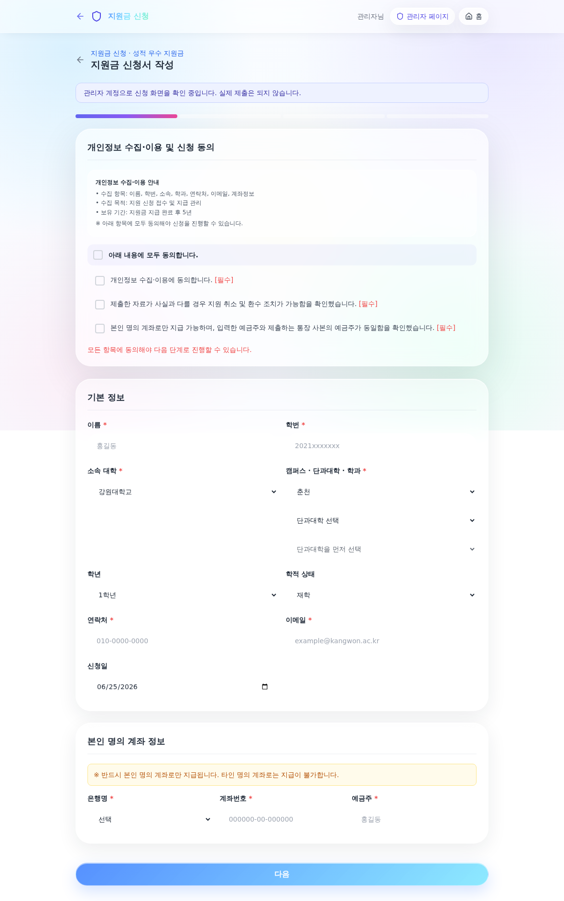
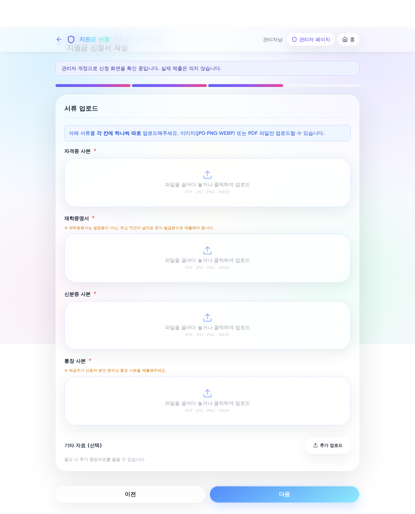

# 신청자 매뉴얼 — 학생 지원금 신청 플랫폼

이 문서는 학생이 사업단 지원금을 **온라인 플랫폼에서 신청**하는 방법을 단계별로 안내합니다.

---

## ⭐ 가장 먼저 (필수): 본인 명의 계좌 등록

지원금은 **학생 본인 명의 계좌로만** 지급되며, 지급은 **연구통합관리시스템에 입력한 계좌정보로 자동 처리**됩니다.
**계좌를 등록하지 않으면 지원금을 받을 수 없습니다.**

1. **연구통합관리시스템(학생용)** 접속 → https://knu-icf.kangwon.ac.kr/issue_main2.act
2. 로그인 후 **본인 명의 계좌정보**(은행·계좌번호·예금주) 입력
3. 입력값이 정확한지 다시 확인
4. 이후 플랫폼/서류에 제출하는 **통장 사본**은 위 시스템에 등록한 계좌와 **동일**해야 합니다

> 플랫폼 신청서에도 계좌를 입력하지만, **실제 지급 기준 계좌는 연구통합관리시스템 등록 계좌**입니다.

---

## 1단계. 회원가입

플랫폼 첫 화면에서 **로그인 → 회원가입** 탭으로 이동합니다.

- **학적 유형**(대학생/대학원생)을 **먼저 선택**합니다.
- **대학생**: 캠퍼스 → 단과대학 → 학과를 **검색하거나 목록에서 선택**(목록에 없으면 직접 입력)
- **대학원생**: 캠퍼스 → 대학원 종류(일반/전문대학원) → 단과대학·학과·전공 직접 입력
- 학번·이름·비밀번호·연락처·이메일·계좌 등 **모든 항목을 입력**해야 가입됩니다.
- 가입에 사용한 **학번/비밀번호**로 로그인합니다.

---

## 2단계. 지원금 종류 선택

로그인 후 **지원금 신청하기**로 들어가면 종류를 선택합니다.

- **지원신청(활동 전)**: 근로장학금 · 프로그램 참여지원비 · 진행요원비
- **지원금 신청(활동 후)**: 위 + 성적 우수 · 경진대회 입상 · 자격증 취득
- 성적·경진대회·자격증은 **학기별 신청기간**이 있으니, 홈 화면의 **‘유형별 지급 기준’**과 카드의 **🗓️ 신청기간**을 확인하세요.

---

## 3단계. 신청서 작성

### (1) 개인정보 동의 + 기본 정보 + 계좌

- 먼저 **개인정보 수집·이용 및 신청 동의**에 체크합니다.
- **기본 정보**(이름·학번·소속·연락처 등)는 가입 정보가 자동 입력됩니다. 확인 후 수정하세요.
- **본인 명의 계좌 정보**(은행·계좌번호·예금주)를 입력합니다.
  > ⚠️ 제출하는 **통장 사본**과 예금주·계좌번호가 **일치**해야 하며, **연구통합관리시스템에 등록한 계좌와 동일**해야 합니다.

### (2) 신청 내용(유형별 상세)

- 유형에 따라 입력 항목이 다릅니다.
  - 성적 우수: 세부 유형(마이크로디그리/부전공/복수전공), 이수 교과목·평점
  - 경진대회: 대회 정보, 개인/팀(팀이면 팀원 입력 → **n분의 1 지급**)
  - 자격증: 자격증명·발급기관·취득일
  - 프로그램 참여지원비/진행요원비/학생활동지원비: 프로그램·활동 내용, 등록비·교통비·숙박비 등

### (3) 서류 업로드

- 각 서류를 **칸마다 따로** 업로드합니다(드래그 앤 드롭 또는 클릭).
- 예) 자격증: 자격증 사본 · 재학증명서 · 신분증 사본 · 통장 사본
  > **재학증명서는 열람용이 아닌 직인 날인본**으로 제출하세요(업로드 시 안내창이 뜹니다).
- 형식: PDF · JPG · PNG · WEBP

### (4) 신청 내용 확인 + 서명 → 제출

- 마지막 단계에서 **신청 내용 확인** 후 **신청인 서명**(직접 서명 또는 이미지 업로드)을 하고 **제출**합니다.

---

## 4단계. 마이페이지에서 확인·관리

제출 후 **마이페이지**에서 다음을 할 수 있습니다.

- **내 신청 내역**과 진행 상태(접수·검토·승인 등) 확인
- **임시저장**한 신청 **이어서 작성**
- **비밀번호 변경**
- **학적상태변경**(대학원 진학 등으로 학번이 바뀌는 경우 → 학번·학적상태 변경, 기존 신청 기록은 그대로 유지)
- 계좌·프로필 정보 확인

---

## 자주 묻는 질문

- **Q. 지원금이 언제 들어오나요?**
  A. 심의·승인 후 **연구통합관리시스템에 등록한 본인 계좌**로 지급됩니다. 계좌 미등록 시 지급이 불가합니다.
- **Q. 통장 사본과 입력 계좌가 다르면?**
  A. 지급이 보류됩니다. 반드시 **본인 명의·동일 계좌**로 맞춰주세요.
- **Q. 신청기간이 지났어요.**
  A. 성적·경진대회·자격증은 학기별 기간 내에만 신청할 수 있습니다. 다음 기간에 신청하거나 사업단에 문의하세요.
- **Q. 임시저장이 되나요?**
  A. 작성 중 **임시저장** 후 마이페이지에서 이어서 작성할 수 있습니다.

문의: 사업단 사무국 033-250-7879 / sducoss@kangwon.ac.kr
